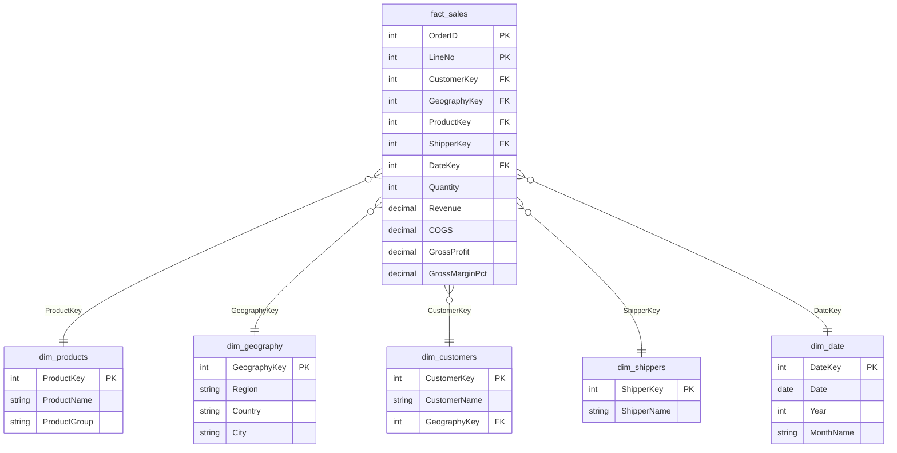

# 🚀 ACME Inc. Enterprise Data Platform

### Production-Grade Databricks Medallion Architecture Pipeline & BI Dashboard

This repository contains the end-to-end design, automation, and reporting implementation of the data platform built for **ACME Inc.** using the **Databricks Medallion Architecture**.

---

## 🏗️ Architecture Overview

The platform enforces strict data quality and modular execution across three distinct layers:

1. **Bronze (Ingestion):** Ingests raw source Excel sheets from UC Volumes into schema-locked Delta tables.
2. **Silver (Cleansing & Modeling):** Normalizes structures, eliminates orphaned rows, maps legacy fields, and builds the Kimball Star Schema.
3. **Gold (Aggregations):** Materializes reporting views and enterprise KPIs optimized for business intelligence execution.

---

## 📂 Project Structure & Script Mapping

The platform is driven by a series of sequential production notebooks:

- `00_setup.py` : Script that create schema on Databricks: bronze, silver, gold
- `01_bronze_ingestion.py`: Ingests raw files from Unity Catalog volumes into Delta format.
- `02_bronze_profiling.py`: Automatically profiles types, schemas, and missing keys.
- `03_silver_cleansing.py`: Enforces data cleansing rules and applies default placeholders (e.g., Unknown Shippers).
- `04_silver_star_schema.py`: Compiles conformed dimensions and builds the fact layer with an integrated Python DQ Gate.
- `05_gold_kpis.sql`: Materializes semantic views tailored for executive canvas querying.

---

---

## 📐 Data Warehouse Dimensional Model (Silver Star Schema)

To support advanced business intelligence and reporting requirements, the cleansed silver layer data was modeled into a classic **Kimball Star Schema**. This approach ensures optimal query performance, clear data lineage, and high reusability for downstream analytics.

The architecture consists of a central, highly-optimized **Fact Table** containing grain-level metrics and transactional measures, surrounded by fully-conformed **Dimension Tables**:



## ⚙️ How the Pipeline Works (Data Flow Diagram)

Below is the end-to-end data flow and execution lifecycle across the Medallion platform:

```text
 [ Legacy Source ] ---------> ( UC Volume Upload )
                                     |
                                     | 01_bronze_ingestion.py
                                     v
                        +-------------------------+
                        |      BRONZE LAYER       |
                        |  (Raw Delta Tables)     |
                        +-------------------------+
                                     |
                                     | 02_bronze_profiling.py & 03_silver_cleansing.py
                                     v
                        +-------------------------+
                        |      SILVER LAYER       |
                        |   (Kimball Dimensions)  |
                        +-------------------------+
                                     |
                                     | 04_silver_star_schema.py
                                     v
                        +-------------------------+
                        |    fact_sales Build     |
                        +-------------------------+
                                     |
                                     v
                        /=========================\
                       <   Automated Python Gate   >
                        \=========================/
                                     |
                    +----------------+----------------+
                    |                                 |
            [ Audit Passes ]                  [ Audit Fails ]
                    |                                 |
                    v                                 v
        +-----------------------+             +-----------------------+
        |      GOLD LAYER       |             |     Pipeline HALT     |
        |   (05_gold_kpis.sql)  |             |   (Raise Exception)   |
        +-----------------------+             +-----------------------+
                    |
                    | Query Engine Execution
                    v
        +-----------------------+
        |   Databricks AI/BI    |
        |    Reporting Canvas   |
        +-----------------------+


```

---

## 📊 Business Intelligence & Reporting Layer

The materialized tables in the **Gold Tier** directly feed ACME Inc.'s executive reporting canvas, deployed inside Databricks SQL based on core business requirements:

- **Executive Revenue Snapshot:** Tracking Year-to-Date (YTD) cumulative progress against Last Year-to-Date (LYTD) targets.
- **Product Group Analytics:** Dual-axis visualization mapping total absolute Revenue against profit margin percentages.
- **Geographical Performance:** Deep-dive stacked bar charts parsing total corporate revenue by `Country` and operational `Region`.

---

## 🖼️ Dashboard Preview

Below is the verified preview of the live production-ready dashboard running on the Databricks Lakehouse Platform, querying the finalized semantic layers:


